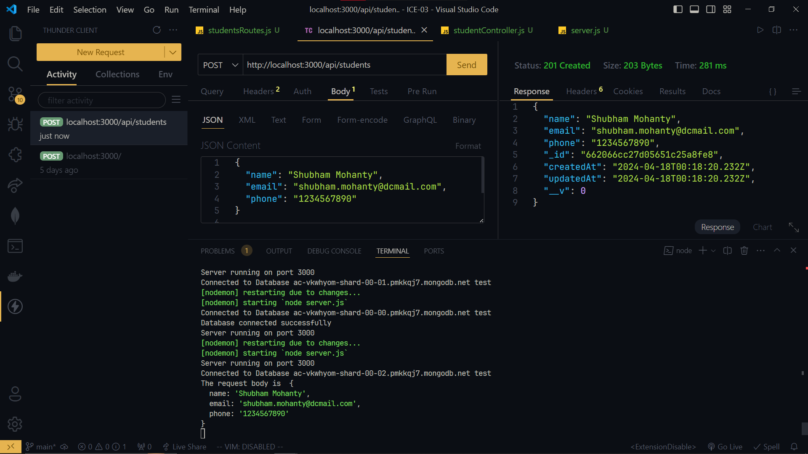
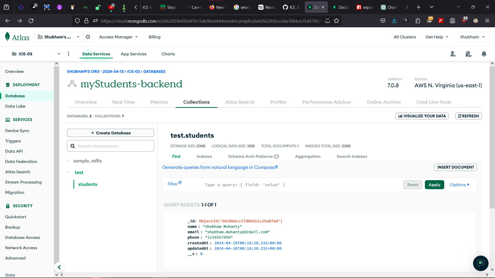

# ABOUT

This repository contains ICE-3 for INFT-2202.

Essentially this repo is to get familiar with Express, MongoDb - using middlewares,
routes for api calls for a demo student database testing basic CRUD operations.

## WORKING ROUTES - SCREENSHOT

## DATABASE WORKING - SCREENSHOT

